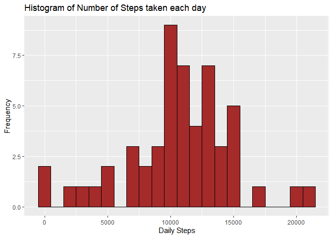
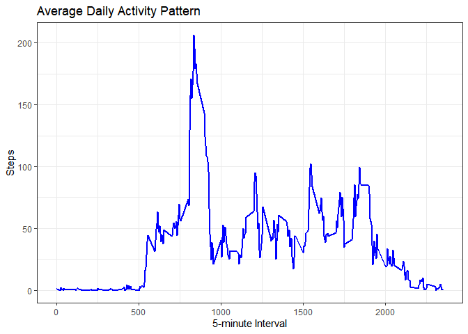
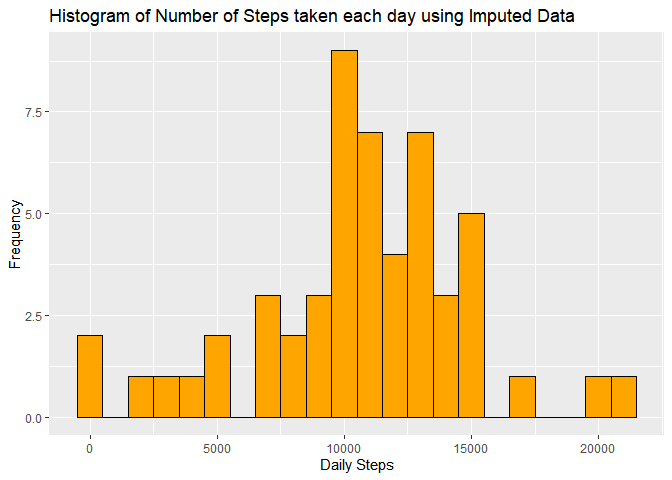
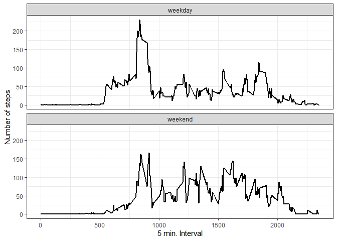

Install dplyr and ggplot2 library.


```r
## Installing required libraries for plotting and data transforming
library(dplyr)
library(ggplot2)
```

Load the data.


```r
## Loading and preprocessing the data
unzip("activity.zip")
data <- read.csv("activity.csv", header = TRUE, sep = ",", na.strings = "NA")
```

## 1. What is mean total number of steps taken per day?


```r
## Using aggregate function to obtain the sum of steps daily
data_daily_steps <- aggregate(steps ~ date, data=data, FUN=sum)
```

### Make a histogram of the total number of steps taken each day


```r
## Use ggplot to plot the histogram
histplot <- ggplot(data_daily_steps, aes(x=steps)) + 
  geom_histogram(binwidth = 1000, color="black", fill="brown") + 
  labs(title="Histogram of Number of Steps taken each day", y="Frequency", x="Daily Steps") 
histplot
```

<!-- -->

### Calculate and report the mean and median total number of steps taken per day


```r
mean(data_daily_steps$steps)
```

```
## [1] 10766.19
```

```r
median(data_daily_steps$steps)
```

```
## [1] 10765
```
  Mean total number of steps taken per day is 10766.19.
  
  Median total number of steps taken per day is 10765.
  
  
## 2. What is the average daily activity pattern?

### Make a time series plot (i.e. type = "l") of the 5-minute interval (x-axis) and the average number of steps taken, averaged across all days (y-axis)


```r
## Aggregate average steps by interval and create time series plot using line chart 
data_daily_interval <- aggregate(steps~interval,data=data,FUN=mean)

avg_daily_patt_plot <- ggplot(data_daily_interval, aes(x=interval, y=steps)) + 
  geom_line(color = "blue", size=1) + 
  theme_bw() +
  labs(title="Average Daily Activity Pattern", y="Steps", x="5-minute Interval") 
avg_daily_patt_plot
```

<!-- -->

### Which 5-minute interval, on average across all the days in the dataset, contains the maximum number of steps?

```r
## Finding the interval which has maximum no of steps
max_step_ind <- which.max(data_daily_interval$step)
max_step_interval <- data_daily_interval$interval[max_step_ind]
print(paste("The 5-min interval which contains the maximum number of steps is at interval", max_step_interval, "with", round(max(data_daily_interval$step),digits = 0), "steps." ))
```

```
## [1] "The 5-min interval which contains the maximum number of steps is at interval 835 with 206 steps."
```


## 3. Imputing missing values

### Calculate and report the total number of missing values in the dataset (i.e. the total number of rows with NAs)


```r
## Finding NAs in the dataset
missing_steps <- sum(is.na(data$steps))
missing_dates <- sum(is.na(data$date))
missing_intervals <- sum(is.na(data$interval))
```
The total number of rows with missing data (NAs) is 2304 under the steps variable. No missing data found in date and interval column.


```r
str(data_daily_interval)
```

```
## 'data.frame':	288 obs. of  2 variables:
##  $ interval: int  0 5 10 15 20 25 30 35 40 45 ...
##  $ steps   : num  1.717 0.3396 0.1321 0.1509 0.0755 ...
```
### Devise a strategy for filling in all of the missing values in the dataset.
### Create a new dataset that is equal to the original dataset but with the missing data filled in.


```r
## Strategy for filling in all of the missing values in the dataset is to use the mean steps at each interval to replace the missing data
imputed_data  <- data
for(r in 1:nrow(imputed_data)){
  if (is.na(imputed_data$steps[r])) {
    rep <- data_daily_interval$steps[data_daily_interval$interval == imputed_data$interval[r]];
    imputed_data$steps[r] <- rep;
  }
}
## Checked that all NAs have been replaced
sum(is.na(imputed_data$steps))
```

```
## [1] 0
```

### Make a histogram of the total number of steps taken each day and Calculate and report the mean and median total number of steps taken per day. Do these values differ from the estimates from the first part of the assignment? What is the impact of imputing missing data on the estimates of the total daily number of steps?


```r
## Create histogram of new dataset with replaced values
data_daily_imputed_steps <- aggregate(steps ~ date, data=data, FUN=sum)
histplot2 <- ggplot(data_daily_imputed_steps, aes(x=steps)) + 
  geom_histogram(binwidth = 1000, color="black", fill="orange") + 
  labs(title="Histogram of Number of Steps taken each day using Imputed Data", y="Frequency", x="Daily Steps") 
histplot2
```

<!-- -->


```r
mean(data_daily_imputed_steps$steps)
```

```
## [1] 10766.19
```

```r
median(data_daily_imputed_steps$steps)
```

```
## [1] 10765
```
From the above observations, values do not differ much from the estimates from the first part of the assignment.

As we have used mean steps at interval to replace to the missing values, there is little to no impact of imputing missing data on the estimates of the total daily number of steps.

## 4. Are there differences in activity patterns between weekdays and weekends?

### Create a new factor variable in the dataset with two levels -- "weekday" and "weekend" indicating whether a given date is a weekday or weekend day.


```r
# Create new column to separate the weekday and weekends
imputed_data_with_day <- imputed_data
imputed_data_with_day$day <- "weekday"
imputed_data_with_day$day[weekdays(as.Date(imputed_data_with_day$date), abb=T) %in% c("Sat","Sun")] <- "weekend"
imputed_data_with_day$day <- as.factor(imputed_data_with_day$day)
```


### Make a panel plot containing a time series plot (i.e. type = "l") of the 5-minute interval (x-axis) and the average number of steps taken, averaged across all weekday days or weekend days (y-axis). 


```r
## Create panel plot to compare between weekday and weekend steps activity

day_steps_interval <- aggregate(imputed_data_with_day$steps, by = list(interval = imputed_data_with_day$interval,day =imputed_data_with_day$day), FUN=mean)

ggplot(day_steps_interval, aes(x=interval, y=x)) + 
        geom_line(color="black", size = 1) + 
        facet_wrap(~ day, nrow=2, ncol=1) +
        labs(x="5 min. Interval", y="Number of steps")  +
        theme_bw()
```

<!-- -->

From the above line chart, We can see that the number of steps are generally consistent for intervals between 800 to 2100 during weekend days. However for weekdays, the number of steps are high only during the intervals between 800 to before 1000 and remained low throughout the rest o the day.

